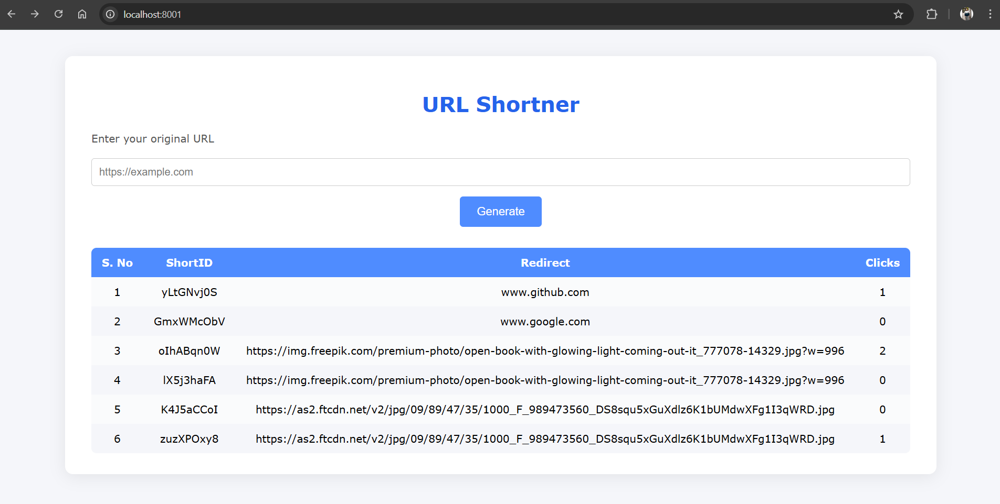
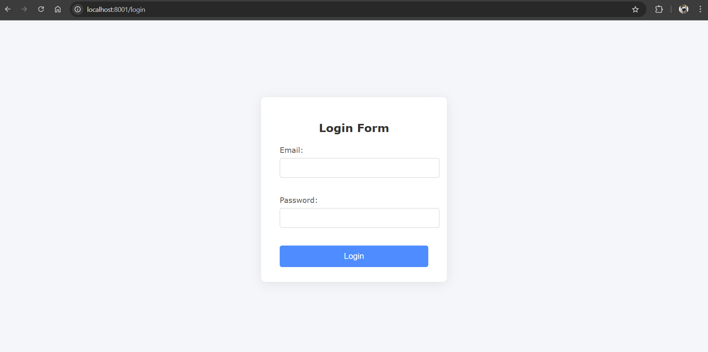
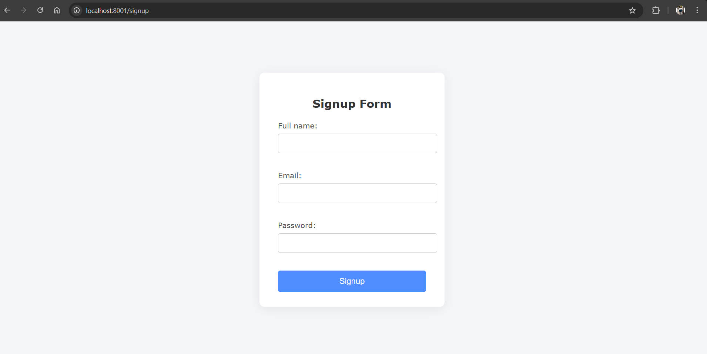

# 🔗 Short-Url - URL Shortener

[](LICENSE)
[](https://nodejs.org/)
[](https://www.mongodb.com/)
[](#)

---

## 📖 Overview
**Short-Url** is a simple and secure URL shortener that:  
✅ Converts long URLs into short, easy-to-share links  
✅ Tracks click analytics for each shortened URL  
✅ Offers fast and efficient MongoDB database operations  
✅ Built with Node.js, Express, MongoDB, Mongoose, and nanoid  

---

## ✨ Features
- 🔗 **Input:** Users enter a long URL  
- ⚡ **Processing:** Generates a unique short code using Express & nanoid  
- 🚀 **Output:** Returns a short URL redirecting to the original  
- 📊 **Tracking:** Monitor the number of times a short URL is accessed  
- 🔒 Secure & scalable architecture with MongoDB  
- 👥 User Authentication (Login/Signup)

---

## 🛠 Tech Stack
| Technology    | Role                        |
|---------------|-----------------------------|
| Node.js       | Backend runtime             |
| Express       | REST API framework          |
| MongoDB       | NoSQL database              |  
| nanoid        | Unique short code generator |
| React         | Frontend UI                 |
| HTML/CSS/JS   | Styling & interactivity     |

---

## 📦 Usage
1. Visit `http://localhost:8001`
2. Enter a long URL to generate a shortened version
3. Share the shortened URL
4. Track click statistics from the dashboard

---

## 📸 Screenshots

### 🏠 Home Page


### 🔐 Login Page


### 📝 Signup Page


---

## 🚀 Installation

### Clone the Repository
```bash
git clone https://github.com/your-username/short-url.git
cd short-url
